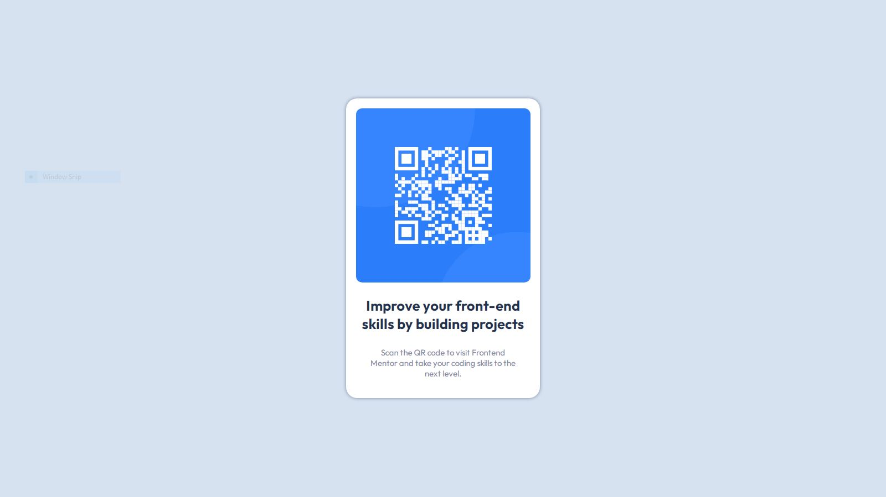

# QR Code - Solution

This is a solution to the QR Code Solution Challenge using HTML and CSS only.

## Table of contents

- [Overview](#overview)
  - [Screenshot](#screenshot)
  - [Links](#links)
- [My process](#my-process)
  - [Built with](#built-with)

## Overview

### Screenshot

### Links

- Live Site URL: [Live Site](https://qr-code-solution-aj.netlify.app/)

## My process

### Built with

- Semantic HTML5 markup
- CSS custom properties
- Flex
- Media Query
- Box-Shadow
- etc.
